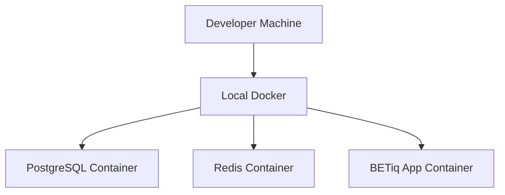
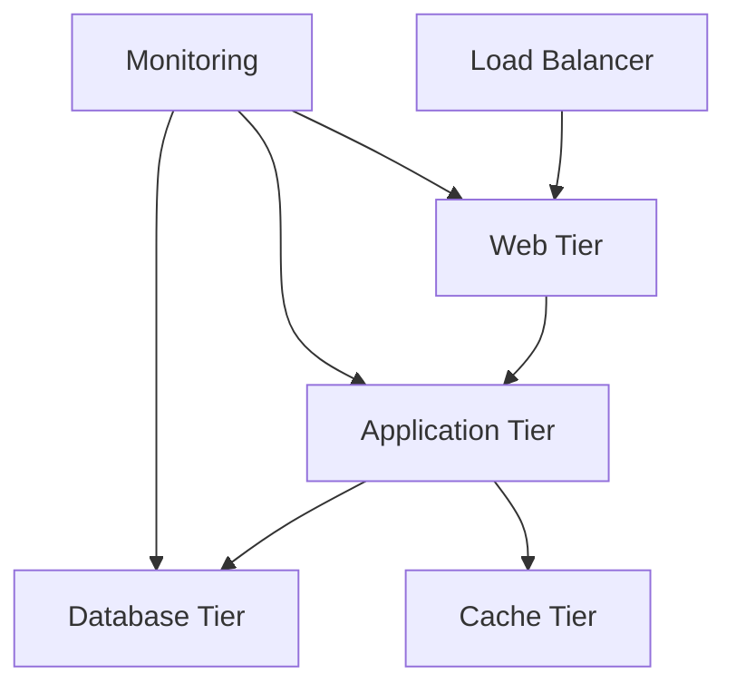

## System Overview

BETiq is built on a modern, scalable architecture that enables high-performance data processing and analytics. The platform follows microservices principles with clear separation of concerns.

## Core Components

BETiq consists of several key components that work together to provide comprehensive business intelligence capabilities:

### Application Layer

<CardGroup cols={2}>
  <Card title="Web Application" icon="window">
    **Frontend Interface**
    - React-based dashboard
    - Real-time visualization
    - Interactive reporting
    - Mobile-responsive design
  </Card>
  <Card title="API Gateway" icon="network-wired">
    **RESTful API**
    - Authentication & authorization
    - Rate limiting
    - Request routing
    - Response caching
  </Card>
</CardGroup>

### Processing Layer

<CardGroup cols={2}>
  <Card title="Data Engine" icon="database">
    **ETL Pipeline**
    - Real-time data ingestion
    - Data transformation
    - Quality validation
    - Schema evolution
  </Card>
  <Card title="Analytics Engine" icon="chart-line">
    **Computation Framework**
    - Statistical analysis
    - Machine learning models
    - Predictive analytics
    - Custom algorithms
  </Card>
</CardGroup>

### Data Layer

<CardGroup cols={2}>
  <Card title="Data Warehouse" icon="server">
    **PostgreSQL Cluster**
    - Transactional data
    - Metadata storage
    - User management
    - Configuration data
  </Card>
  <Card title="Analytics Store" icon="hard-drive">
    **Time-Series Database**
    - Historical metrics
    - Aggregated data
    - Performance optimization
    - Compression algorithms
  </Card>
</CardGroup>

## Design Principles

BETiq's architecture is built on these core principles:

### Scalability

<Accordion title="Horizontal Scaling">
- **Microservices Architecture**: Independent service scaling
- **Load Balancing**: Distribute traffic across instances
- **Auto-scaling**: Dynamic resource allocation based on demand
- **Database Sharding**: Distribute data across multiple nodes
</Accordion>

### Reliability

<Accordion title="High Availability">
- **Redundancy**: Multiple instances of critical services
- **Failover**: Automatic switching to backup systems
- **Health Monitoring**: Continuous system health checks
- **Circuit Breakers**: Prevent cascade failures
</Accordion>

### Security

<Accordion title="Defense in Depth">
- **Authentication**: Multi-factor authentication support
- **Authorization**: Role-based access control (RBAC)
- **Encryption**: Data encryption at rest and in transit
- **Audit Logging**: Comprehensive activity tracking
</Accordion>

## Data Flow Architecture

Understanding how data flows through BETiq:

<Steps>
  <Step title="Data Ingestion">
    **Sources → Ingestion Layer**
    - Multiple data source connectors
    - Real-time streaming ingestion
    - Batch processing capabilities
    - Data validation and cleansing
  </Step>
  <Step title="Processing & Transformation">
    **Raw Data → Processed Data**
    - ETL pipeline execution
    - Data normalization
    - Business rule application
    - Quality assurance checks
  </Step>
  <Step title="Storage & Indexing">
    **Processed Data → Data Store**
    - Optimized storage strategies
    - Indexing for fast retrieval
    - Data partitioning
    - Compression algorithms
  </Step>
  <Step title="Analytics & Visualization">
    **Data Store → User Interface**
    - Query optimization
    - Real-time dashboards
    - Interactive visualizations
    - Export capabilities
  </Step>
</Steps>

## Technology Stack

BETiq leverages modern technologies for optimal performance:

### Backend Technologies

| Component | Technology | Purpose |
|-----------|------------|---------|
| **Application Framework** | Django/Flask | Web application backend |
| **API Framework** | FastAPI | High-performance API server |
| **Task Queue** | Celery + Redis | Asynchronous job processing |
| **Search Engine** | Elasticsearch | Full-text search capabilities |
| **Cache Layer** | Redis | High-speed data caching |

### Frontend Technologies

| Component | Technology | Purpose |
|-----------|------------|---------|
| **UI Framework** | React 18+ | Interactive user interface |
| **State Management** | Redux Toolkit | Application state management |
| **Visualization** | D3.js, Chart.js | Data visualization components |
| **Styling** | Tailwind CSS | Responsive design system |

### Infrastructure Technologies

| Component | Technology | Purpose |
|-----------|------------|---------|
| **Containerization** | Docker | Application packaging |
| **Orchestration** | Kubernetes | Container management |
| **Monitoring** | Prometheus + Grafana | System monitoring |
| **Logging** | ELK Stack | Centralized logging |

## Deployment Architecture

BETiq supports multiple deployment scenarios:

### Development Environment

### Production Environment

## Security Architecture

BETiq implements comprehensive security measures:

<CardGroup cols={2}>
  <Card title="Network Security" icon="shield-halved">
    - VPN access requirements
    - Firewall configurations
    - Network segmentation
    - SSL/TLS encryption
  </Card>
  <Card title="Application Security" icon="lock">
    - Input validation
    - SQL injection prevention
    - XSS protection
    - CSRF tokens
  </Card>
  <Card title="Data Security" icon="database-lock">
    - Data encryption at rest
    - Column-level encryption
    - Backup encryption
    - Access logging
  </Card>
  <Card title="Identity Management" icon="users-gear">
    - LDAP/Active Directory integration
    - Single sign-on (SSO)
    - Multi-factor authentication
    - Role-based permissions
  </Card>
</CardGroup>

## Performance Considerations

Key architectural decisions for optimal performance:

### Query Optimization

- **Indexing Strategy**: Optimized database indexes
- **Query Caching**: Redis-based query result caching
- **Connection Pooling**: Efficient database connections
- **Materialized Views**: Pre-computed aggregations

### Scaling Strategies

- **Read Replicas**: Distribute read operations
- **Partitioning**: Horizontal data partitioning
- **CDN Integration**: Static asset distribution
- **Async Processing**: Non-blocking operations

## Integration Points

BETiq provides multiple integration options:

<Accordion title="API Integration">
- RESTful APIs for data access
- GraphQL endpoints for complex queries
- Webhook support for real-time notifications
- SDK libraries for common programming languages
</Accordion>

<Accordion title="Data Source Connectors">
- Database connectors (MySQL, PostgreSQL, Oracle)
- Cloud storage integration (AWS S3, Azure Blob)
- Streaming platforms (Kafka, RabbitMQ)
- File formats (CSV, JSON, Parquet, Excel)
</Accordion>

## Next Steps

<CardGroup cols={2}>
  <Card title="Installation Guide" icon="download" href="/installation">
    Install BETiq in your environment
  </Card>
  <Card title="Configuration" icon="gear" href="/configuration/environment">
    Configure BETiq components
  </Card>
  <Card title="Development Setup" icon="code" href="/development/local-setup">
    Set up development environment
  </Card>
  <Card title="API Reference" icon="code" href="/api-reference/authentication">
    Explore BETiq APIs
  </Card>
</CardGroup>